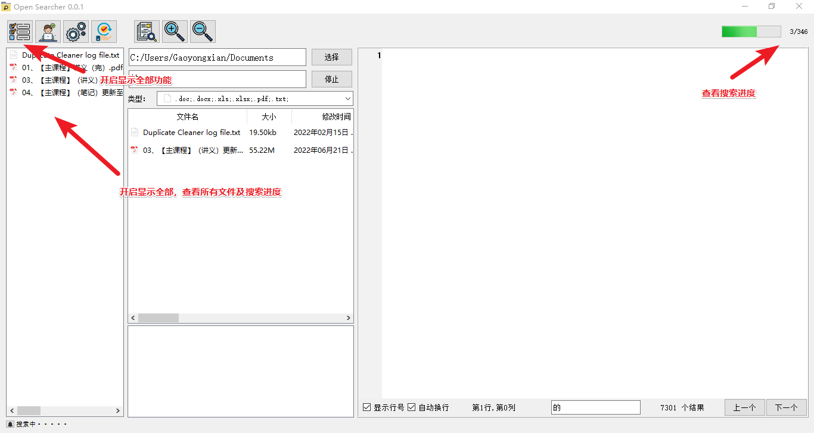

# OpenSearcher
一个基于PyQT5开源的、本地的、安全的、支持全文检索的搜索器。

## 文件类型 

* doc
    * [antiword](http://www.winfield.demon.nl/)：http://www.winfield.demon.nl/。    
    * [Word.Application]()：https://github.com/mhammond/pywin32。
* xls  
    * [xlrd](https://github.com/python-excel/xlrd)：https://github.com/python-excel/xlrd。  
    * [Excel.Application](https://github.com/mhammond/pywin32)：https://github.com/mhammond/pywin32。
* docx  
    * [docx2txt](https://github.com/ankushshah89/python-docx2txt)：https://github.com/ankushshah89/python-docx2txt。
* xlsx
   * [xlsx2csv](https://github.com/dilshod/xlsx2csv)：https://github.com/dilshod/xlsx2csv。    
* pdf
   * [pdfminer.six](https://github.com/pdfminer/pdfminer.si)：https://github.com/pdfminer/pdfminer.six。  
    

## 使用提示

* 提前建立索引缓存，将大大加快之后的搜索。
* 搜索进行中，尽量不要预览，可能会卡顿。如果卡顿，请等待一下。  

## 界面预览

 

  

  

## 文件下载

* 绿色版：  
* 安装包：  

