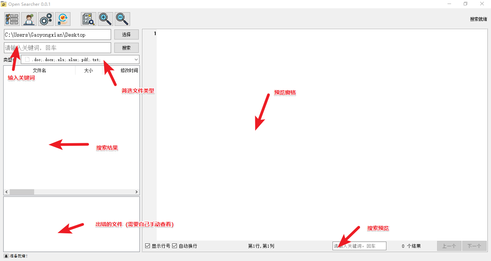
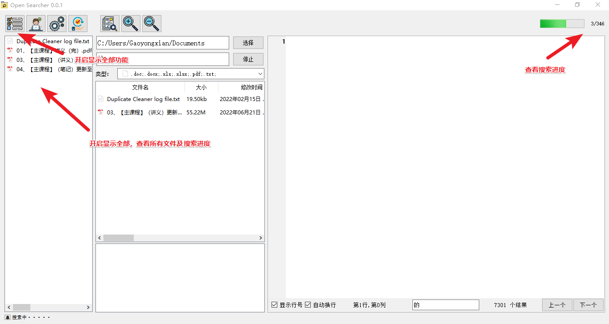
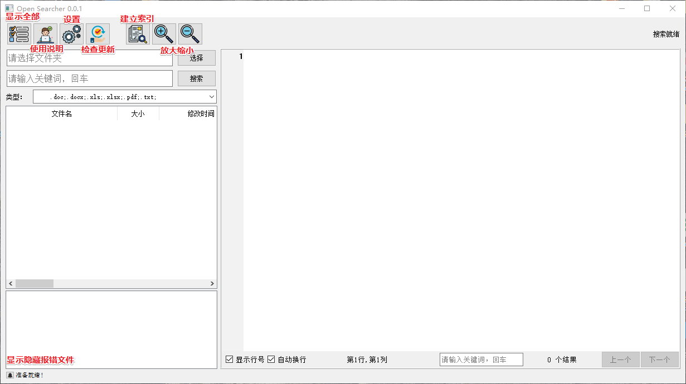

# OpenSearcher  
一个基于 PyQt5 **本地的**、**安全的**、**开源的**、支持**全文检索**的搜索器。本项目使用纯**Python**编写，所使用的**第三方包**都为**开源库**。  

<br />

## 文件类型  
* ```doc``` Via [antiword](http://www.winfield.demon.nl/)  
* ```xls``` Via [xlrd](https://github.com/python-excel/xlrd)  
* ```docx ``` Via [docx2txt](https://github.com/ankushshah89/python-docx2txt)  
* ```xlsx``` Via [xlsx2csv](https://github.com/dilshod/xlsx2csv)  
* ```pdf``` Via [pdfminer.six](https://github.com/pdfminer/pdfminer.six)  
* ```doc、xls``` Via [pywin32](https://github.com/mhammond/pywin32)  

<br/>

## 使用提示
1. 利用```空闲时间```，提前```建立索引```缓存很重要，将大大加快之后的搜索。（本项目并没有强制要求建立索引缓存，还是由你自己决定是否建立索引缓存，如果你经常进行全盘随机搜索，推荐建立索引缓存）
2. 如果```搜索进行```中，```预览```可能会卡顿。如果卡顿，请等待一下。（出现卡顿的原因是当前搜索速度过快加上用户频繁操作导致的Ui阻塞，通常情况不会出现这种卡顿）  
3. 在```第一次搜索```某个文件目录时，搜索速度或许不是很快，但是下次```搜索相同目录```将会很快。(原因就是第一次搜索的时候还没有建立索引缓存)  

<br />

## 关于速度
&nbsp;&nbsp;搜索时间大部分都是消耗在第一次处理文件，也就是建立索引缓存那个过程。所以有时你在第一次搜索某个目录的时候感觉不是很快，但是如果你第二次搜索相同的目录将会很快。
原理是我在第一次处理文件时留下缓存文件，之后的搜索会根据文件md5值判断文件是否改变，如果文件内容没有改变直接读取缓存，如果文件内容改变将重新处理，这样就会大大提示搜索速度。
最后，推荐大家在空闲时间要提前建立索引，这样下次搜索会很快。

<br />

## 关于项目
&nbsp;&nbsp;这实际上是一个仿照AnyTxT写的项目，只是因为AnyTxT不开源，由于保密原则，某些环境下无法使用，所以自己写了一个开源项目，如果你单位也有保密原则，不妨试试，本项目所有依赖和包都是开源的，你也可以查看项目代码，自行打包。

<br />

## 开源地址
* https://github.com/Gaoyongxian666/OpenSearcher

<br />

## 开发环境

```pip install -r requirements.txt```

<br />

## 界面预览

 

  

  


## 界面预览

 

  

  


## 更新日志
* 0.0.4
  * 2022.11.26 感谢坛友 @会飞的花 提出的建议：添加常用目录功能。   
* 0.0.3
  * 2022.11.24 修改部分bug。
* 0.0.2
  * 2022.11.24 完善了一下代码，感谢坛友 @会飞的花 提出的建议：添加了记录字号、字体、换行、行号、上次搜索目录功能。 
* 0.0.1
  * 2022.11.20 第一次完成项目代码。

<br />

## 文件下载

* 0.0.4
* [绿色版](https://gaoyongxian.lanzouy.com/ifXB00gz177c)  
* [安装包](https://gaoyongxian.lanzouy.com/icaEw0gz12pa)  
* 百度网盘下载链接
链接: https://pan.baidu.com/s/1iiFdEUzlq85tpfZgrMdv-Q?pwd=6t85 提取码: 6t85 复制这段内容后打开百度网盘手机App，操作更方便哦

